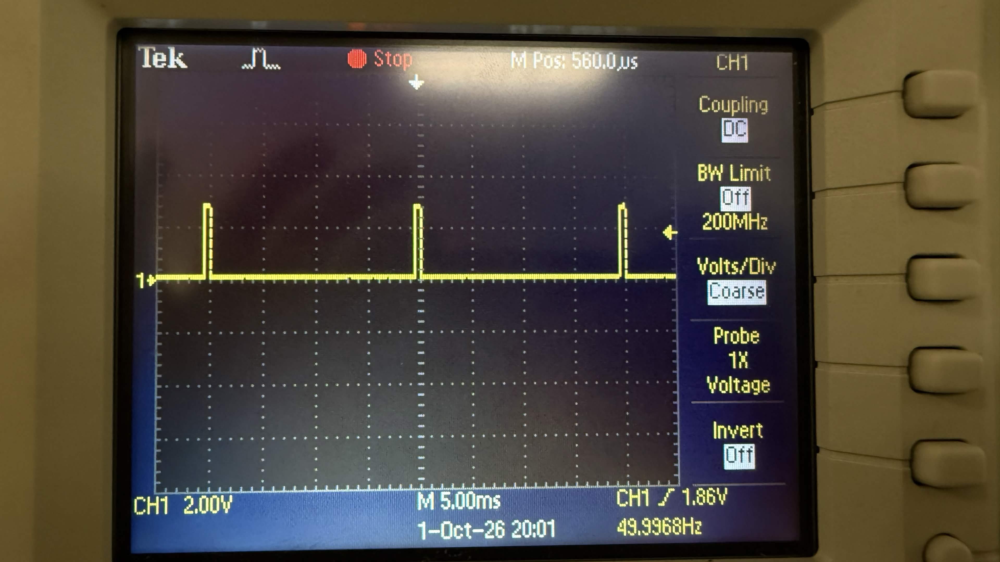
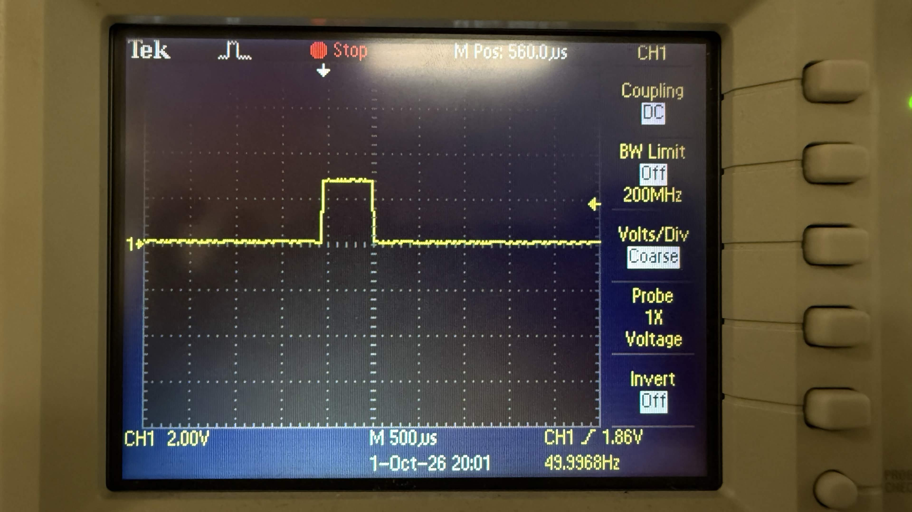
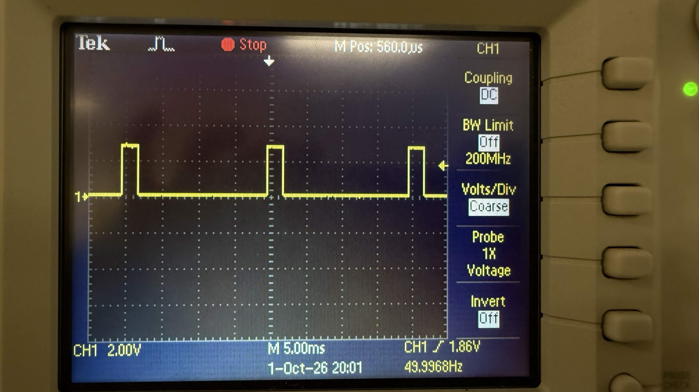
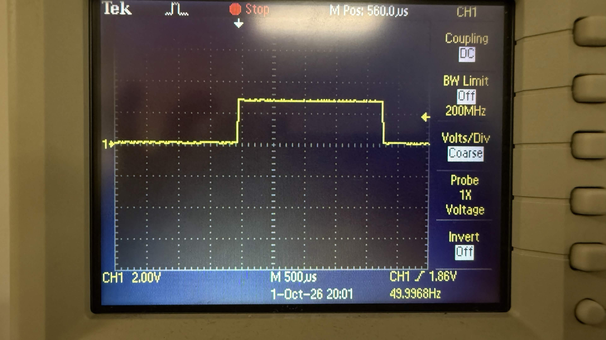
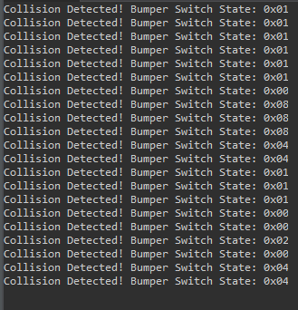
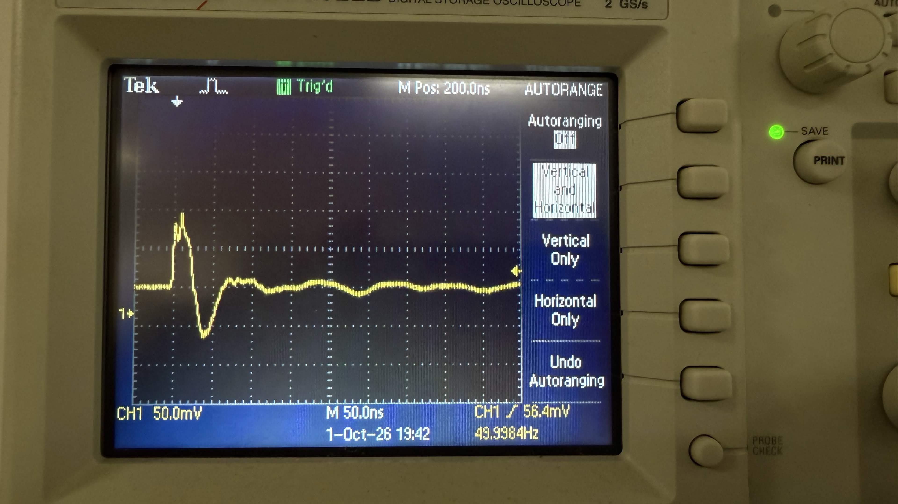

# ECE 528/L - Robotics and Embedded Systems with Lab

**CSU Northridge**

**Department of Electrical and Computer Engineering**

# ECE 528/L - Lab 1: Motor Control

## Overview

This lab focused on motor control using the MSP432P401R and TI-RSLK MAX. Timer_A was configured to generate PWM signals for controlling DC motors and servo motors. The bumper switches were also programmed to perform a predefined movement when a collision was detected. An oscilloscope was used to verify PWM signals and observe bouncing from bumper switches.

## Components Used

- MSP432P401R LaunchPad
- TI-RSLK MAX Chassis
- Bumper Switches
- Two HS-485HB Servo Motors
- Oscilloscope
- Oscilloscope Probes
- USB-A to Micro-USB Cable
- Breadboard
- Jumper Wires

## Analysis and Results

### Servo Motor PWM

Timer_A2 was used to generate two PWM signals on pins P5.6 and P5.7 to control the two HS-485HB servo motors. The PWM signals had a refresh rate of approximately 50 Hz. The duty cycles were changed to control the position of each servo.

#### Servo at 0 Degrees

The servo motors were commanded to rotate counterclockwise to the 0-degree position and initially started in this position. The oscilloscope was used to verify the PWM signals generated on P5.6 and P5.7 while the RGB LED was red.

#### Servo 0 Degree Pulse Width

The pulse width of the PWM signal at the 0-degree servo position was measured using the oscilloscope. The measured pulse width was approximately 550 us. The horizontal scale of the oscilloscope was set to 500 us/div.

#### Servo at 180 Degrees

The servo motors were commanded to rotate clockwise to the 180-degree position. The oscilloscope was used to observe the PWM signals while the RGB LED was blue.

#### Servo 180 Degree Pulse Width

The pulse width of the PWM signal at the 180-degree servo position was measured using the oscilloscope. The measured pulse width was approximately 2350 us. The horizontal scale of the oscilloscope was set to 500 us/div.

### Bumper Switches

The bumper switches were configured as GPIO inputs with pull-up resistors enabled. Falling-edge interrupts were configured so that an interrupt was generated whenever one of the bumper switches was pressed. The interrupt service routine cleared the interrupt flags and executed the bumper switch handler.

#### Serial Terminal Output

The bumper switches were displayed on the serial terminal whenever a bumper switch was pressed. The output showed the corresponding bumper-switch value, showcasing which switch was activated.

### Switch Bouncing

Switch bouncing was observed when the bumper switch was pressed. A single physical press could produce multiple rapid signal transitions before the signal settled. This could also result in multiple collision messages appearing in the serial terminal from a single bumper-switch press. The oscilloscope was used to observe the bumper-switch signal.

### Timer_A0 PWM

Timer_A0 was configured to generate PWM signals for controlling the left and right DC motors. Pins P2.6 and P2.7 were configured for the Timer_A peripheral function. SMCLK was used as the clock source, the timer clock was divided by 8, and Timer_A0 was configured in Up/Down mode.

### DC Motor Control

Functions were implemented to initialize and control the two DC motors. The motor direction pins determined whether each motor moved forward or backward, while the Timer_A0 duty cycles controlled the motor speed. Motor functions were used to make the robot move forward, backward, left, and right.

### Collision Handling

When a collision was detected by the bumper switches, the robot performed a predefined recovery sequence. It stopped for two seconds, moved backward for two seconds at a 30% duty cycle, stopped for one second, turned right for four seconds at a 10% duty cycle, and stopped for another two seconds. The collision flag was then cleared.

## Known Issues or Limitations

One known issue that was resolved was that the path was predetermined and would not use the bumper collision to reset.

## References

- MSP432P401R SimpleLink Microcontroller LaunchPad Development Kit User's Guide
- MSP432P401R Datasheet
- Robot Systems Learning Kit (TI-RSLK) User Guide
- MSP432P4xx SimpleLink Microcontrollers Technical Reference Manual
- Left Bumper Switch for TI-RSLK MAX
- Right Bumper Switch for TI-RSLK MAX
- TI DRV8838 Motor Driver Datasheet
- HS-485HB Servo Datasheet
- (https://canvas.csun.edu/courses/192095/files/folder/01_Labs?preview=35916666)
- User LEDs of the TI MSP432 LaunchPad
- Pololu Gearmotor with Encoder - (https://www.pololu.com/product/3675)
- Left Bumper Switches for TI-RSLK MAX - (https://www.pololu.com/product/3673)
- Right Bumper Switches for TI-RSLK MAX -(https://www.pololu.com/product/3674)
- HS-485HB Servo-Stock Rotation - (https://www.servocity.com/hs-485hb-servo/)
